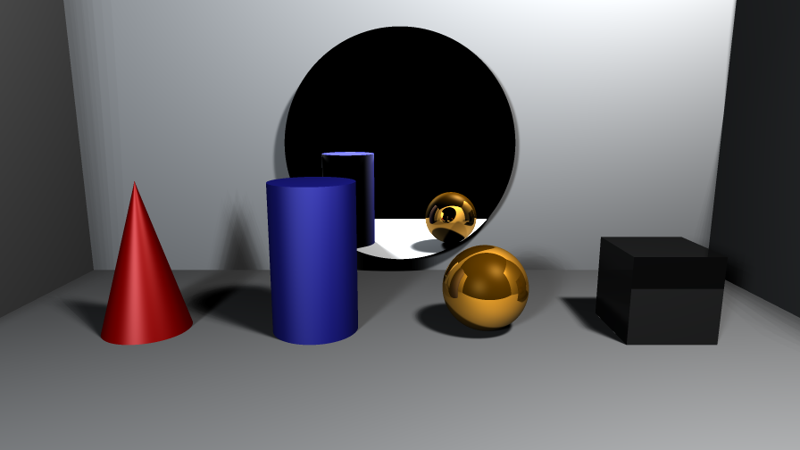

# Standalone Simple Ray Tracer
A simple ray tracer covering basic mechanics.
\
\
**IDE:** Visual Studio\
**Language:** C++

### Example Render

### Added Light types
1 - Ambient Light\
2 - Directional Light\
3 - Point Light\
4 - Spot Light\
5 - Rectangular Light

### Added Primitives
1 - Sphere\
2 - Plane\
3 - Disk\
4 - Intersection(Render only intersection of added objects)\
5 - Union(Render union of added objects)\
6 - Box\
7 - Cone\
8 - Cylinder

### Camera models
1 - Perspective Camera\
2 - Isometric Camera

### Additional Features
1 - Anti-aliased Rendering\
2 - Soft Shadows

### Roadmap
1 - Multithread rendering\
2 - Complex model import\
3 - PBR
